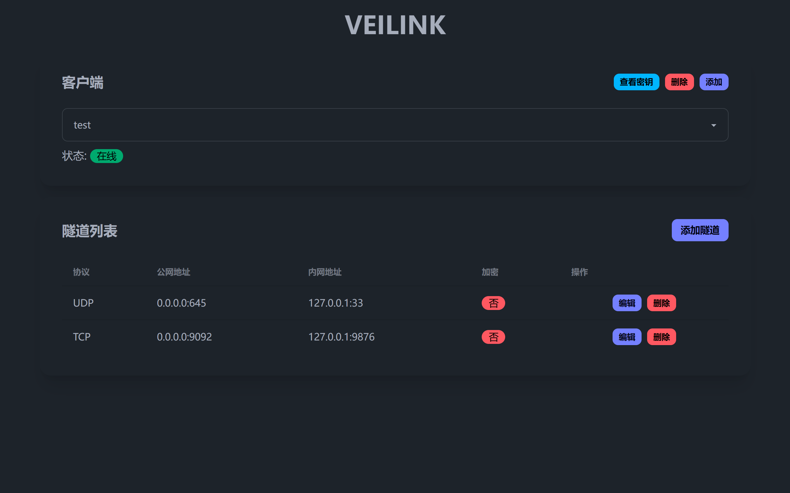

# VEILINK
Go语言实现的轻量级内网穿透工具，配置简单易用。
- TCP/UDP协议支持
- 流式chacha20加密
- webui动态管理
## 编译
```bash
$ make build os=linux arch=amd64
```
## 运行
### Server
自行修改server.yaml配置
```bash
$ ./bin/veilink_server_linux_amd64 -c [config file path]
```
Example config:
```yaml
level: trace
webui:
    access_key: "123456"
    port: 9529
    ip: 0.0.0.0
gateway:
    ip: 0.0.0.0
    port: 9528
    debug_info: true
clients:
    - client_id: test
      listeners:
        - client_id: test
          encrypt: false
          debug_info: false
          public_protocol: udp
          public_ip: 0.0.0.0
          public_port: 645
          internal_ip: 127.0.0.1
          internal_port: 33
        - client_id: test
          encrypt: false
          debug_info: false
          public_protocol: tcp
          public_ip: 0.0.0.0
          public_port: 9092
          internal_ip: 127.0.0.1
          internal_port: 9876
    - client_id: dawda
      listeners: []
```
### Client
```bash
$ ./bin/veilink_client_linux_amd64 -ip=[server ip] -port=[server port] -id=[client id] -level=[logrus level] -encrypt=[encrypt true or false] -key=[encrypt key]
```
## Webui
访问http://[server ip]:[webui port]，输入access_key，即可访问webui。

## 原理图

## 关于流式加密
- 服务端启动时，若某个客户端的任意协议穿透开启加密，则会随机生成一个32字节密钥，并使用Base64编码为字符串后输出到控制台和./key/[client_id].key。
- 客户端启动时将该Key编码后的字符串作为参数传入，若客户端开启加密，则使用该Key对数据进行加密。
- 服务端会发送一条消息到客户端，指示客户端是否开启加密。
- 通过该Key，服务端和客户端都会重写tunnelConn的Write和Read方法，开启流式加密传输。
### 示意图
