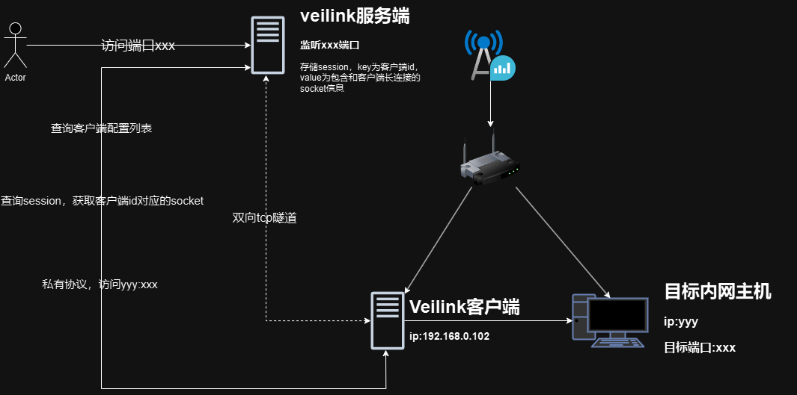

# Veilink
Go语言实现的轻量级内网穿透工具，配置简单易用，支持TCP/UDP协议，TCP协议支持流式chacha20加密。
## 编译
```bash
$ make build os=linux arch=amd64
```
## 运行
### server
自行修改server.toml配置
```bash
$ ./bin/veilink_server_linux_amd64 -c [config file path]
```
example config:
```toml
[gateway]
ip = "0.0.0.0" # server ip
port = 9527    # server port

[[listeners]]
client_id = "test"
public_protocol = "udp"         # 协议
public_ip = "0.0.0.0"
public_port = 9091
internal_ip = "114.114.114.114"
internal_port = 53

[[listeners]]
client_id = "test"
encrypt = true                  # 是否开启加密 仅支持tcp协议 生成key输出到控制台和./key/[client_id].key
public_protocol = "tcp"   # 协议
public_ip = "0.0.0.0"
public_port = 9092
internal_ip = "127.0.0.1"
internal_port = 8000
```
### client
```bash
$ ./bin/veilink_client_linux_amd64 -ip=[server ip] -port=[server port] -id=[client id] -encrypt=[encrypt true or false] -key=[encrypt key]
```

## TODO
- UDP协议加密
- 对外提供SOCKS5协议代理
- 将内网SOCKS5代理穿透到公网
- webui动态管理
## 原理图
