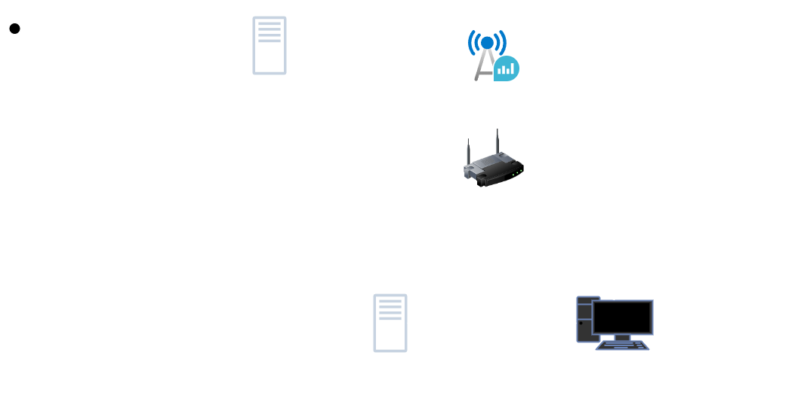

# go-veilink
Go语言实现内网穿透工具，支持TCP/UDP协议。
## 编译
```bash
$ make build os=linux arch=amd64
```
## 运行
### server
自行修改server.toml配置
```bash
$ ./bin/veilink_server_linux_amd64 -c ../internal/config/server.toml 
```
### client
```bash
$ ./bin/veilink_client_linux_amd64 -ip [server ip] -port [server port] -id [client id]
```
## 原理图
